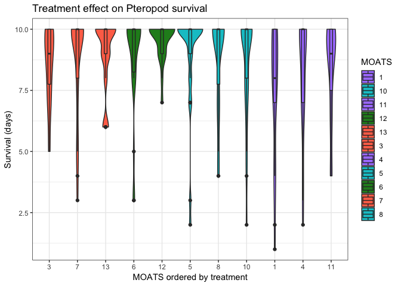
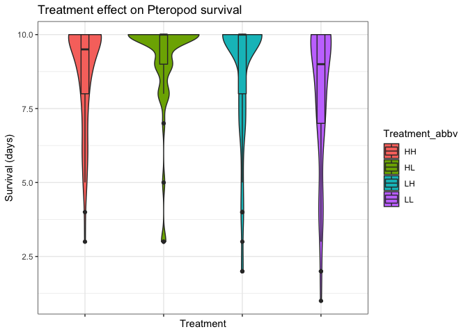
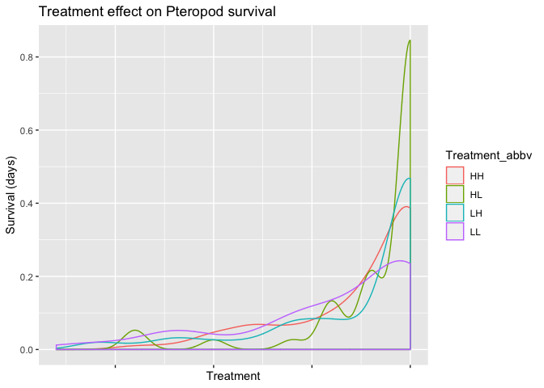

2016 pteropod survival
================
Shelly Trigg
4/3/2019

Load libraries

``` r
library(readxl)
library(tidyr)
library(ggplot2)
library(FSA)
```

    ## ## FSA v0.8.22. See citation('FSA') if used in publication.
    ## ## Run fishR() for related website and fishR('IFAR') for related book.

Read in data

``` r
#survival data
d <- read_xlsx("~/Documents/GitHub/pteropod_pHxDO_metabolomics/survival/pteropod_pHxDO2016_masterdatasheet.xlsx", sheet = "sample IDs living", skip = 2)
```

    ## New names:
    ## * `` -> `..1`
    ## * `` -> `..2`
    ## * `` -> `..15`

``` r
#treatment data
treatments <- read.csv("~/Documents/GitHub/Seawater-Chemistry-Analysis/2016-17_PteropodExp_WaterChem/PteropodWaterChem/Treatments.csv", stringsAsFactors = FALSE)
```

Format survival data

``` r
#fix column names which are dates
weird_date <- as.numeric(colnames(d)[3:11], quote = FALSE)
good_dates <- as.Date(weird_date, origin = '1899-12-30')

#convert d to data frame
d <- data.frame(d)

#convert date column names to reformated date strings
colnames(d)[3:11] <- as.character(good_dates)

#rename the first two columns
colnames(d)[1:2] <- c("MOATS", "Jar")

#remove rows containing repetitive date info
d <- d[-grep("^42",d$`2016-11-22`),]

#remove rows containing only NAs
d <- d[which(!is.na(d$`2016-11-22`)),]

#add column for first day everything was put on MOATS
d$`2016-11-21` <- "L"

#reorder columns so dates are all next to each other
d <- d[,c(1,2,16,3:15)]

#remove MOATS 2 and 9 which had problems
d <- d[-grep("M2|M9", d$MOATS),]
```

Create a summary data frame of survival data containing the frequency of each status listed in each date (e.g. for M13 jar A1, it has 10 L's across all dates so this would have a 10 in the L column; for M1 jar A1, is has 7 L's, 1 D, and 2 "--" so this would have a 2 in the "--" column, a 7 in the "L" column, and a 1 in the "D" column)

``` r
#create empty data frame to be filled in by loop
dsummary <- data.frame()
#loop through each row of d (the formatted survival data)
for(i in 1:nrow(d)){
  dtemp <- data.frame(table(t(d[i,3:12]))) # create a data frame of a frequency table with each status listed as a different row and it's frequency in the next column
  dtemp$ID <- paste(d$MOATS[i],d$Jar[i], sep = "_") # add the MOATS and jar info as another column to the frequency table
  dsummary <- rbind(dsummary, dtemp) # append status frequency table create for each row to the empty data frame
}

#turn the status variables into columns
dsummary <- spread(dsummary, "Var1", "Freq")
head(dsummary)
```

    ##      ID ----  D  L  M 2L LL
    ## 1 M1_A1    2  1  7 NA NA NA
    ## 2 M1_A2    7  1  2 NA NA NA
    ## 3 M1_A3    8  1  1 NA NA NA
    ## 4 M1_A4    5  1  4 NA NA NA
    ## 5 M1_A5   NA NA 10 NA NA NA
    ## 6 M1_A6    2  1  7 NA NA NA

``` r
#exclude animals that went missing and live but lost since we can't determine what happened with them
#and also 2L because we don't know where they came from

dsummary <- dsummary[which(is.na(dsummary$M) & is.na(dsummary$LL) & is.na(dsummary$`2L`)),]


#create MOATS and jar columns
dsummary$MOATS <- gsub("_.*","",dsummary$ID)
dsummary$MOATS <- gsub("M","",dsummary$MOATS)
dsummary$Jar <- gsub(".*_","",dsummary$ID)

#merge treatment info with dsummary
dsummary <- merge(dsummary, treatments, by = "MOATS")

#save survival data summary
write.csv(dsummary, "~/Documents/GitHub/pteropod_pHxDO_metabolomics/survival/summary_of_survival_data_noM2orM9orStatusM_L_2L.csv", row.names = FALSE, quote = FALSE)
```

``` r
ggplot(dsummary, aes(factor(MOATS, levels = c(3,7,13,6,12,5,8,10,1,4,11)),L)) + geom_violin(aes(fill = MOATS)) + geom_boxplot(aes(fill = MOATS), width = 0.1) + theme_bw() + scale_fill_manual(values = c("mediumpurple1","turquoise3","mediumpurple1","forestgreen","coral1","coral1","mediumpurple1","turquoise3","forestgreen","coral1","turquoise3")) + xlab("MOATS ordered by treatment") + ylab("Survival (days)") + ggtitle("Treatment effect on Pteropod survival")
```



``` r
#plot by treatment
ggplot(dsummary, aes(Treatment_abbv,L)) + geom_violin(aes(fill = Treatment_abbv)) + geom_boxplot(aes(fill = Treatment_abbv), width = 0.1) + theme_bw() + theme(axis.text.x = element_blank(), strip.text.x = element_text(size = 7)) + xlab("Treatment") + ylab("Survival (days)") + ggtitle("Treatment effect on Pteropod survival")
```



``` r
#plot density to check normality
ggplot(dsummary) + geom_density(aes(L, color = Treatment_abbv)) + theme(axis.text.x = element_blank(), strip.text.x = element_text(size = 7)) + xlab("Treatment") + ylab("Survival (days)") + ggtitle("Treatment effect on Pteropod survival")
```



Test if there is a statistically significant difference in survival between treatment groups

Data is not normal so do a kruskal wallis test

``` r
#kruskal test
kruskal.test(L ~ as.factor(Treatment_abbv), data = dsummary)
```

    ## 
    ##  Kruskal-Wallis rank sum test
    ## 
    ## data:  L by as.factor(Treatment_abbv)
    ## Kruskal-Wallis chi-squared = 11.983, df = 3, p-value = 0.007441

Kruskal test is significant so determine which treatment groups are statistically different by Dunn test I found information about the Dunn test here: [<https://rcompanion.org/rcompanion/d_06.html>](https://rcompanion.org/rcompanion/d_06.html)

``` r
#dunn test
dunnTest(L ~ as.factor(Treatment_abbv), data = dsummary, method = "bh")
```

    ## Dunn (1964) Kruskal-Wallis multiple comparison

    ##   p-values adjusted with the Benjamini-Hochberg method.

    ##   Comparison         Z     P.unadj      P.adj
    ## 1    HH - HL -1.719614 0.085502718 0.17100544
    ## 2    HH - LH -1.131275 0.257939271 0.30952712
    ## 3    HL - LH  0.736434 0.461466642 0.46146664
    ## 4    HH - LL  1.594922 0.110729738 0.16609461
    ## 5    HL - LL  3.093264 0.001979681 0.01187809
    ## 6    LH - LL  2.714395 0.006639695 0.01991909

Dunn test shows that HL and LL are statistically different and LH and LL are statistically different, but that no other groups are statistically different. So there was more death in LL than in HL or LL, but not more than the ambient control group.
