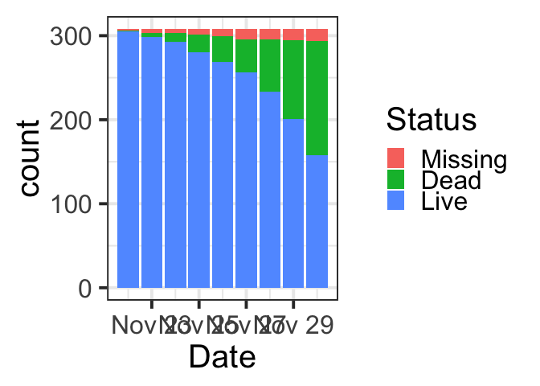
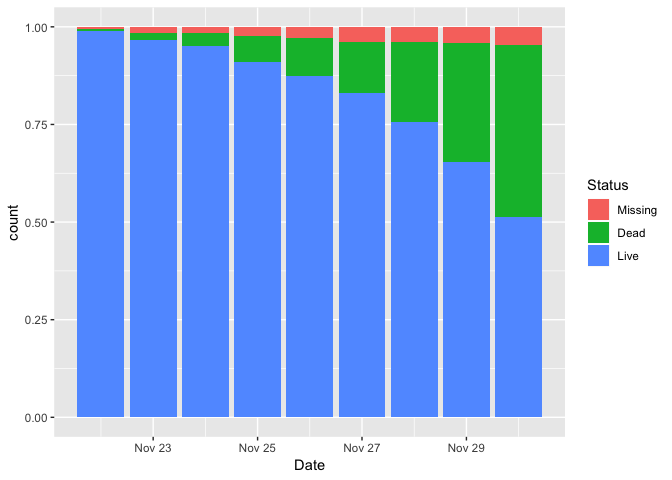
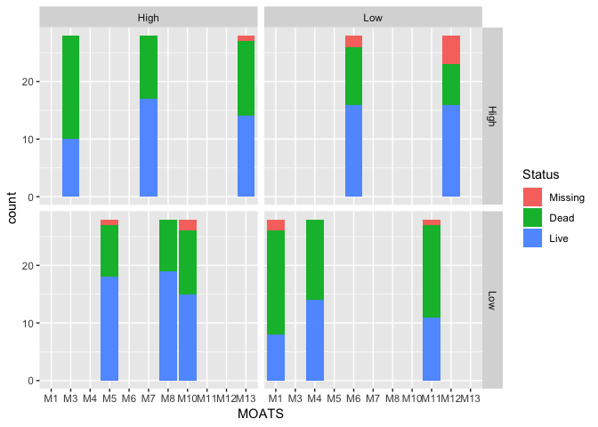
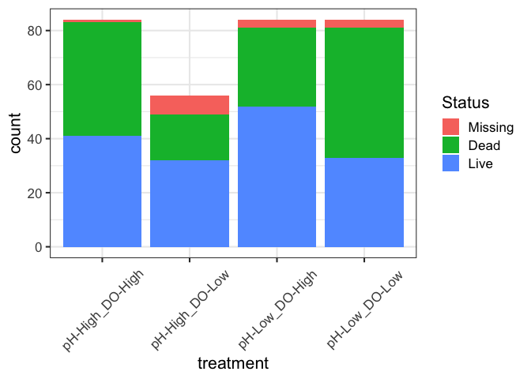
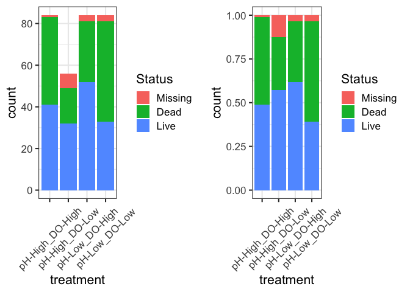
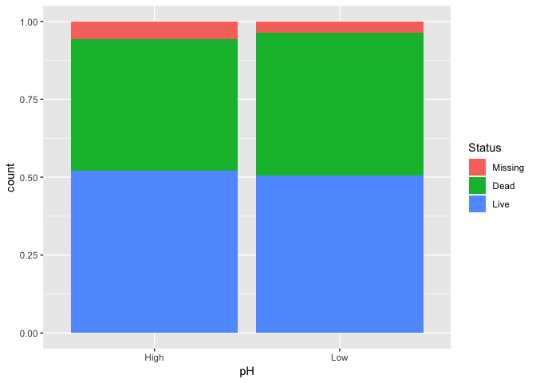
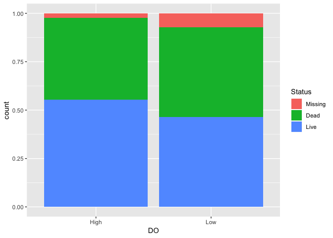

2016 pteropod survival proportions analysis
================
Shelly Trigg
5/6/2019

1.  Load libraries

<!-- -->

    ## ## FSA v0.8.23. See citation('FSA') if used in publication.
    ## ## Run fishR() for related website and fishR('IFAR') for related book.

    ## Loading required package: ggpubr

    ## Loading required package: magrittr

    ## 
    ## Attaching package: 'magrittr'

    ## The following object is masked from 'package:tidyr':
    ## 
    ##     extract

    ## 
    ## Attaching package: 'ggpubr'

    ## The following object is masked from 'package:plyr':
    ## 
    ##     mutate

    ## Loading required package: Matrix

    ## 
    ## Attaching package: 'Matrix'

    ## The following object is masked from 'package:tidyr':
    ## 
    ##     expand

    ## 
    ## Attaching package: 'lmerTest'

    ## The following object is masked from 'package:lme4':
    ## 
    ##     lmer

    ## The following object is masked from 'package:stats':
    ## 
    ##     step

    ## Loading required package: bdsmatrix

    ## 
    ## Attaching package: 'bdsmatrix'

    ## The following object is masked from 'package:base':
    ## 
    ##     backsolve

    ## 
    ## Attaching package: 'survMisc'

    ## The following object is masked from 'package:ggplot2':
    ## 
    ##     autoplot

1.  Read in data

``` r
#survival data
d <- read_xlsx("~/Documents/GitHub/pteropod_pHxDO_metabolomics/survival/pteropod_pHxDO2016_masterdatasheet.xlsx", sheet = "sample IDs living", skip = 2)
```

    ## New names:
    ## * `` -> ...1
    ## * `` -> ...2
    ## * `` -> ...15

``` r
#treatment data
treatments <- read.csv("~/Documents/GitHub/Seawater-Chemistry-Analysis/2016-17_PteropodExp_WaterChem/PteropodWaterChem/Treatments.csv", stringsAsFactors = FALSE)
treatments$MOATS <- paste0("M",treatments$MOATS)
class(treatments) 
```

    ## [1] "data.frame"

1.  Format survival data

``` r
#fix column names which are dates
weird_date <- as.numeric(colnames(d)[3:11], quote = FALSE)
good_dates <- as.Date(weird_date, origin = '1899-12-30')

#convert d to data frame
d <- data.frame(d)

#convert date column names to reformated date strings
colnames(d)[3:11] <- as.character(good_dates)

#rename the first two columns
colnames(d)[1:2] <- c("MOATS", "Jar")

#remove rows containing repetitive date info
d <- d[-grep("^42",d$`2016-11-22`),]

#remove rows containing only NAs
d <- d[which(!is.na(d$`2016-11-22`)),]

#modify dataframe to replace "---" with "D" (for dead) or "M" (for missing)
# once dead or missing, the pteropod remains dead or missing for remainder of experiment
## "LL" is "lost live" and was live on the day recorded and missing on subsequent days.
for(i in 1:length(d$MOATS)){
  for(j in 3:10){
    if(d[i,j] == "D"){
      d[i,j+1] <- "D"
    }
    if(d[i,j] == "M"){
      d[i,j+1] <- "M"
    }
    if(d[i,j] == "LL"){
      d[i,j+1] <- "M"
      d[i,j] <- "L"
    }
  }
  if(d[i,11] == "LL"){
    d[i,11] <- "L"
  }
}
# idividuals recorded as "2L had 2 live pteropods observed in the jar
# this only occured where one of the pteropods was extremely small and the other large
# this difference in size is why 2 pteropds were not observed in previous checks
# it was a assumed that all subsequnt observations just focuse on the large pteropod
#so the jar was just treated as single live
d[d=="2L"] <- "L"


#remove MOATS 2 and 9 which had problems
d <- d[-grep("M2|M9", d$MOATS),]


#crab_id column
d$animalID <- paste(d$MOATS, d$Jar, sep = "_")

#reformat date column
STACKED_d <- tidyr::gather(d, Date, Status, 3:11)


STACKED_d$Date <- as.POSIXct(STACKED_d$Date, format = "%Y-%m-%d")
#set the moats levels so that they are sequential
moatsOrder <- paste("M", c(1,3,4,5,6,7,8,10,11,12,13), sep = "")
STACKED_d$MOATS <- factor(STACKED_d$MOATS, levels = moatsOrder)
#set jar and status as factors
STACKED_d$Jar <- factor(STACKED_d$Jar)
STACKED_d$Status <- factor(STACKED_d$Status)
#View(d)
#str(d)
#change M,D andL to Missing, Dead and Live
levels(STACKED_d$Status)
```

    ## [1] "D" "L" "M"

``` r
STACKED_d$Status <- factor(STACKED_d$Status, levels = c("M", "D", "L"))
STACKED_d$Status <- revalue(STACKED_d$Status, c("M"="Missing", "D"="Dead", "L"="Live"))
levels(STACKED_d$Status)
```

    ## [1] "Missing" "Dead"    "Live"

1.  Merge survival data with treatment data

``` r
STACKED_d <- merge(STACKED_d, treatments, by = "MOATS")
STACKED_d$pH <- ifelse(substr(STACKED_d$Treatment_abbv,1,1) == "L","Low","High")
STACKED_d$DO <- ifelse(substr(STACKED_d$Treatment_abbv,2,2) == "L","Low","High")
STACKED_d$treatment <- paste0("pH-",STACKED_d$pH, "_DO-", STACKED_d$DO)


#last day of experiment in R datetime format
lastDay <- as.POSIXct("2016-11-30", format = "%Y-%m-%d")
```

plots of basic pteropod counts in each status category by date and on the last day of the experiment

``` r
ggplot(STACKED_d, aes(Date)) + geom_bar(aes(fill = Status)) + theme_bw(base_size = 30)
```



``` r
ggplot(STACKED_d, aes(Date)) + geom_bar(aes(fill = Status), position = "fill")
```



``` r
ggplot(subset(STACKED_d, Date == lastDay), aes(MOATS)) + geom_bar(aes(fill = Status)) + facet_grid(pH ~ DO)
```



``` r
p1 <- ggplot(subset(STACKED_d, Date == lastDay), aes(treatment)) + geom_bar(aes(fill = Status))+ theme_bw(base_size = 16)+theme(axis.text.x  = element_text(angle=45, vjust=0.5))
p1
```



``` r
p2 <- ggplot(subset(STACKED_d, Date == lastDay), aes(treatment)) + geom_bar(aes(fill = Status), position = "fill")+ theme_bw(base_size = 16)+theme(axis.text.x  = element_text(angle=45, vjust=0.5))
grid.arrange(p1, p2, ncol = 2)
```



``` r
ggplot(subset(STACKED_d, Date == lastDay), aes(pH)) + geom_bar(aes(fill = Status), position = "fill")
```



``` r
ggplot(subset(STACKED_d, Date == lastDay), aes(DO)) + geom_bar(aes(fill = Status), position = "fill")
```



SURVIVAL ANALYSIS
-----------------

``` r
#create a new blank dataset for data to input into survival analysis
nMoats <- nlevels(STACKED_d$MOATS)
nJars <- nlevels(STACKED_d$Jar)
ds <- data.frame(Day = rep(0, (nMoats*nJars)))
ds$Dead <- 0
ds$Moats <- NA
ds$pHtreat <- NA
ds$DOtreat <- NA
ds$Treat <- NA
#View(ds)

#loop to create a dataframe in the format to make a "surv" object for survival analysis
#the format records the day of events (deaths) and the day the pteropod leave the experiment (either by going missing or the end of the experiment)
#days are relative to the start of the experiment (i.e. days of exposure; collection day = 0)
index <- 1
for(i in 1:nMoats){
  for(j in 1:nJars){
    dc <- subset(STACKED_d, MOATS == levels(STACKED_d$MOATS)[i] & Jar == levels(STACKED_d$Jar)[j])
    dc <- dc[order(dc$Date),]
    if(dc$Status[1] == "Dead"){
      ds$Day[index] <- 1
      ds$Dead[index] <- 1
    }
    nDays <- length(dc$Date)
    for(k in 2:nDays){
      if(dc$Status[k-1] == "Live" && dc$Status[k] == "Dead"){
        ds$Day[index] <- k
        ds$Dead[index] <- 1
      }
      if(dc$Status[k-1] == "Live" && dc$Status[k] == "Missing"){
          ds$Day[index] <- k-1
          ds$Dead[index] <- 0
      }
    }
    if(dc$Status[nDays] == "Live"){
      ds$Day[index] <- nDays
      ds$Dead[index] <- 0
    }
    ds$Moats[index] <- as.character(dc$MOATS[1])
    ds$pHtreat[index] <- dc$pH[1]
    ds$DOtreat[index] <- dc$DO[1]
    ds$Treat[index] <- dc$treatment[1]
    index <- index + 1
  }
}
levels(factor(ds$Moats))
```

    ##  [1] "M1"  "M10" "M11" "M12" "M13" "M3"  "M4"  "M5"  "M6"  "M7"  "M8"

``` r
#View(ds)
str(ds)
```

    ## 'data.frame':    308 obs. of  6 variables:
    ##  $ Day    : num  7 2 1 4 9 7 9 4 8 8 ...
    ##  $ Dead   : num  1 1 1 1 0 1 0 1 1 1 ...
    ##  $ Moats  : chr  "M1" "M1" "M1" "M1" ...
    ##  $ pHtreat: chr  "Low" "Low" "Low" "Low" ...
    ##  $ DOtreat: chr  "Low" "Low" "Low" "Low" ...
    ##  $ Treat  : chr  "pH-Low_DO-Low" "pH-Low_DO-Low" "pH-Low_DO-Low" "pH-Low_DO-Low" ...

``` r
#make treatment variables factors
ds$Treat <- factor(ds$Treat)
ds$pHtreat <- factor(ds$pHtreat)
ds$DOtreat <- factor(ds$DOtreat)


#make a surv object to pass into coxme

surv <- Surv(time = ds$Day, event = ds$Dead, type = "right")
```

surival plots of simple K-M surivial probabilites; models does in include interaction design or random MOATS term

cox test

``` r
survFit1 <- coxph(surv ~ pHtreat + DOtreat + pHtreat*DOtreat, ds )
summary(survFit1)
```

    ## Call:
    ## coxph(formula = surv ~ pHtreat + DOtreat + pHtreat * DOtreat, 
    ##     data = ds)
    ## 
    ##   n= 308, number of events= 136 
    ## 
    ##                          coef exp(coef) se(coef)      z Pr(>|z|)   
    ## pHtreatLow            -0.4009    0.6697   0.2415 -1.660  0.09693 . 
    ## DOtreatLow            -0.5206    0.5942   0.2875 -1.811  0.07020 . 
    ## pHtreatLow:DOtreatLow  1.2066    3.3422   0.3717  3.246  0.00117 **
    ## ---
    ## Signif. codes:  0 '***' 0.001 '**' 0.01 '*' 0.05 '.' 0.1 ' ' 1
    ## 
    ##                       exp(coef) exp(-coef) lower .95 upper .95
    ## pHtreatLow               0.6697     1.4932    0.4172     1.075
    ## DOtreatLow               0.5942     1.6830    0.3382     1.044
    ## pHtreatLow:DOtreatLow    3.3422     0.2992    1.6129     6.926
    ## 
    ## Concordance= 0.592  (se = 0.025 )
    ## Likelihood ratio test= 13.05  on 3 df,   p=0.005
    ## Wald test            = 12.8  on 3 df,   p=0.005
    ## Score (logrank) test = 13.27  on 3 df,   p=0.004

``` r
survFitME <- coxme(surv ~ pHtreat*DOtreat + (1|Moats), ds)
summary(survFitME)
```

    ## Cox mixed-effects model fit by maximum likelihood
    ##   Data: ds
    ##   events, n = 136, 308
    ##   Iterations= 5 27 
    ##                    NULL Integrated    Fitted
    ## Log-likelihood -736.556  -730.0321 -730.0237
    ## 
    ##                   Chisq   df         p  AIC   BIC
    ## Integrated loglik 13.05 4.00 0.0110450 5.05 -6.60
    ##  Penalized loglik 13.06 3.01 0.0045313 7.05 -1.71
    ## 
    ## Model:  surv ~ pHtreat * DOtreat + (1 | Moats) 
    ## Fixed coefficients
    ##                             coef exp(coef)  se(coef)     z      p
    ## pHtreatLow            -0.4008981 0.6697183 0.2416249 -1.66 0.0970
    ## DOtreatLow            -0.5205979 0.5941652 0.2876364 -1.81 0.0700
    ## pHtreatLow:DOtreatLow  1.2066743 3.3423505 0.3719008  3.24 0.0012
    ## 
    ## Random effects
    ##  Group Variable  Std Dev      Variance    
    ##  Moats Intercept 9.067664e-03 8.222253e-05

``` r
#r-squared
#https://rdrr.io/cran/survMisc/man/rsq.html
rsq(survFit1, sigD=2)
```

    ## $cod
    ## [1] 0.041
    ## 
    ## $mer
    ## [1] 0.092
    ## 
    ## $mev
    ## [1] 0.058

The standard deviation of the MOATS random effect is very small (0.009) which suggests that MOATS does not really affect the outcome. Also the liklihood ratio test (Chisq) value is the same (13.05), meaning that including MOATS as a random effect does not improve the model. We likely do not need to include it as a random effect.

**Describing the cox model** I based the interpretation off of this article: <http://www.sthda.com/english/wiki/cox-proportional-hazards-model>

1.  Statistical significance. Z = the Wald statistic which evaluates whether the beta coefficient (impact of the covariate) is statistically significantly different from 0. We can conclude that low pH and low DO did not have statistically significant coefficients but their interaction did (p = 0.00117).

2.  Regression coefficient ("coef"). A coef \< 0 means hazard is lower and \> 0 means hazard is higher. So, low pH or low DO treatment led to a lower risk of death (AKA greater survival), but the interaction of low pH and low DO led to greater risk of death (AKA less survival).

3.  Hazard ratio ("exp(coef)"): the effect size of the covariates. Low pH treatment reduced the risk of death by a factor of 0.6697 or ~33%, and low DO treatment reduced the risk of death by a factor of 0.5942 or ~41%. Low pH and low DO treatment increased the risk of death by a factor of 3.3422 or 330%.

4.  confidence intervals of the hazard ratios. So low pH factor reduced risk of death is 0.6697 +

5.  Global statistical significance of the model: p = 0.004528, based on the liklihood ratio test (but also the same p-value when logrank test or wald test is used)

6.  Rsquared: coefficient of determination \< 0.2 means predictive power is low. Coefficient of determination is not generalized to censored data, so measure of explained randomness or measure of explained variation are more popular. These values are still \< 0.2 in this case, so the model has weak predictive power on survival. Reference (<https://apha.confex.com/apha/134am/techprogram/paper_135906.htm>)
