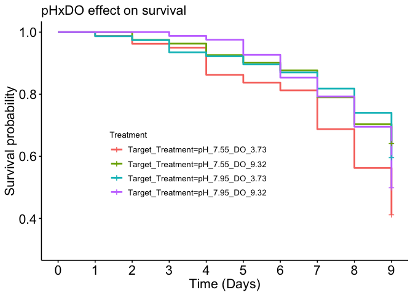
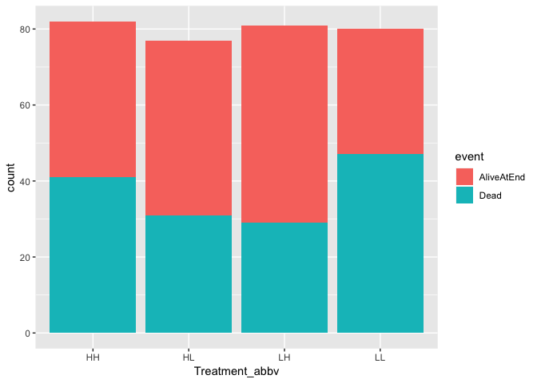
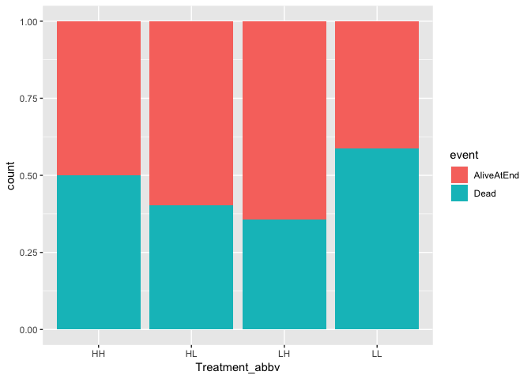
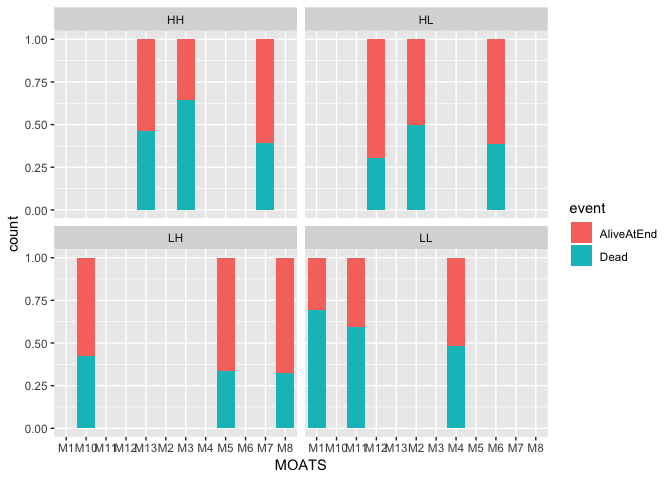
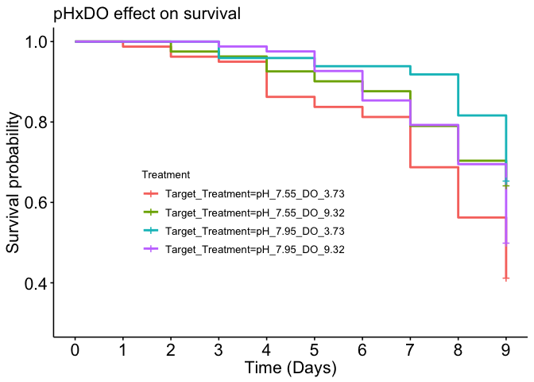
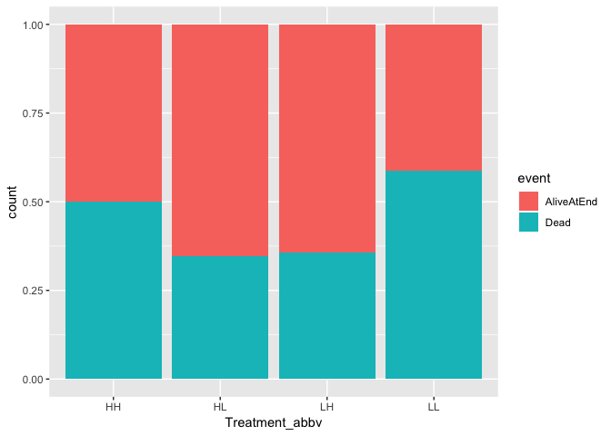

2016 pteropod survival proportions analysis
================
Shelly Trigg
4/15/2019

Load libraries

``` r
library(readxl)
library(tidyr)
library(ggplot2)
library(FSA)
```

    ## ## FSA v0.8.22. See citation('FSA') if used in publication.
    ## ## Run fishR() for related website and fishR('IFAR') for related book.

``` r
library(survminer)
```

    ## Loading required package: ggpubr

    ## Loading required package: magrittr

    ## 
    ## Attaching package: 'magrittr'

    ## The following object is masked from 'package:tidyr':
    ## 
    ##     extract

``` r
library(survival)
library(lme4)
```

    ## Loading required package: Matrix

    ## 
    ## Attaching package: 'Matrix'

    ## The following object is masked from 'package:tidyr':
    ## 
    ##     expand

``` r
library(lmerTest)
```

    ## 
    ## Attaching package: 'lmerTest'

    ## The following object is masked from 'package:lme4':
    ## 
    ##     lmer

    ## The following object is masked from 'package:stats':
    ## 
    ##     step

Read in data

``` r
#survival data
d <- read_xlsx("~/Documents/GitHub/pteropod_pHxDO_metabolomics/survival/pteropod_pHxDO2016_masterdatasheet.xlsx", sheet = "sample IDs living", skip = 2)
```

    ## New names:
    ## * `` -> `..1`
    ## * `` -> `..2`
    ## * `` -> `..15`

``` r
#treatment data
treatments <- read.csv("~/Documents/GitHub/Seawater-Chemistry-Analysis/2016-17_PteropodExp_WaterChem/PteropodWaterChem/Treatments.csv", stringsAsFactors = FALSE)
treatments$MOATS <- paste0("M",treatments$MOATS)
```

Format survival data

``` r
#fix column names which are dates
weird_date <- as.numeric(colnames(d)[3:11], quote = FALSE)
good_dates <- as.Date(weird_date, origin = '1899-12-30')

#convert d to data frame
d <- data.frame(d)

#convert date column names to reformated date strings
colnames(d)[3:11] <- as.character(good_dates)

#rename the first two columns
colnames(d)[1:2] <- c("MOATS", "Jar")

#remove rows containing repetitive date info
d <- d[-grep("^42",d$`2016-11-22`),]

#remove rows containing only NAs
d <- d[which(!is.na(d$`2016-11-22`)),]

#add column for first day everything was put on MOATS
d$`2016-11-21` <- "L1"

#reorder columns so dates are all next to each other
d <- d[,c(1,2,16,3:15)]

#remove MOATS 2 and 9 which had problems
d <- d[-grep("M9", d$MOATS),]


#crab_id column
d$crabID <- paste(d$MOATS, d$Jar, sep = "_")

#reformat date column
STACKED_d <- tidyr::gather(d, date, status, 3:12)

#make event column

for(i in 1:length(STACKED_d$status)){
  if(STACKED_d$status[i] == "L1"){
    STACKED_d$event[i] <- "start"
  }
  if(STACKED_d$status[i] == "D"){
    STACKED_d$event[i] <- "Dead"
  }
  if(STACKED_d$status[i]== "2L"){
    STACKED_d$event[i] <- "unknown"
  }
  if(STACKED_d$status[i] == "M"){
    STACKED_d$event[i] <- "unknown"
  }
  if(STACKED_d$status[i] == "LL"){
    STACKED_d$event[i] <- "unknown"
  }
 if(STACKED_d$status[i] == "L"){
    STACKED_d$event[i] <- "NA"
  }
  if(STACKED_d$status[i] == "----"){
    STACKED_d$event[i] <- "NA"
  }
}
```

remove samples with 2L, M, or LL (2L = 2 animals in one jar (misplacement), M = missing, LL = live but lost..not sure what that actually means)

``` r
bad_ptero_list <- unique(STACKED_d[grep("unknown", STACKED_d$event), "crabID"])

STACKED_d <- STACKED_d[which(!(STACKED_d$crabID %in% bad_ptero_list)),]

#remove columns with no event ("--")

STACKED_d <- STACKED_d[-grep("----", STACKED_d$status),]
```

Add Duration column

``` r
#assign durations
STACKED_d <- STACKED_d[order(STACKED_d$crabID),]
durCounter <- 0
for(i in 1:length(STACKED_d$event)){
  if(STACKED_d$event[i] == "start"){
    durCounter <- 0
  }
  STACKED_d$duration[i] <- durCounter
  durCounter <- durCounter + 1
}
```

Add survival column

``` r
STACKED_d$isDead <- NA
lastDayObs <- "2016-11-30"

for(i in 1:length(STACKED_d$event)){
  if(STACKED_d$event[i] == "Dead"){
    STACKED_d$isDead[i]  <- 1
  }
  if(STACKED_d$status[i] == "L" && STACKED_d$date[i] == lastDayObs){
    STACKED_d$isDead[i] <- 0
    STACKED_d$event[i] <- "AliveAtEnd"
  }

}
```

merge treatment data

``` r
STACKED_d <- merge(STACKED_d, treatments, by = "MOATS")
```

**survival analysis**

``` r
dSub <- STACKED_d[!is.na(STACKED_d$isDead),]
surv <- Surv(time = dSub$duration, event = dSub$isDead, type = "right")
ggsurvplot(survfit(surv ~ Target_Treatment, dSub), risk.table = FALSE, pval = FALSE, conf.int = FALSE,font.main = 16, font.x =  16, font.y = 16, font.tickslab = 16, font.legend = 10, break.time.by = 1,legend = c(0.4, 0.4), legend.title = "Treatment", title = "pHxDO effect on survival", xlab = "Time (Days)", xlim = c(0,9), ylim = c(0.3,1)) 
```



**treatment effect on duration to death**

``` r
durTreat <- aov(duration ~ Treatment_abbv,data = dSub[which(dSub$isDead == 1),])
summary(durTreat)
```

    ##                 Df Sum Sq Mean Sq F value Pr(>F)
    ## Treatment_abbv   3   17.2   5.736   1.286  0.281
    ## Residuals      144  642.1   4.459

**MOATS effect on duration to death**

``` r
durMOATS <- aov(duration ~ MOATS,data = dSub[which(dSub$isDead == 1),])
summary(durMOATS)
```

    ##              Df Sum Sq Mean Sq F value Pr(>F)
    ## MOATS        11   72.3   6.571   1.522   0.13
    ## Residuals   136  587.0   4.317

**Test significance of treatment on duration to death with MOATS as a random effect**

``` r
fitME <- lmer(duration~ Treatment_abbv + (1|MOATS), data = dSub[which(dSub$isDead == 1),])
summary(fitME)
```

    ## Linear mixed model fit by REML. t-tests use Satterthwaite's method [
    ## lmerModLmerTest]
    ## Formula: duration ~ Treatment_abbv + (1 | MOATS)
    ##    Data: dSub[which(dSub$isDead == 1), ]
    ## 
    ## REML criterion at convergence: 637.6
    ## 
    ## Scaled residuals: 
    ##     Min      1Q  Median      3Q     Max 
    ## -2.6886 -0.7520  0.2094  0.6895  1.1938 
    ## 
    ## Random effects:
    ##  Groups   Name        Variance Std.Dev.
    ##  MOATS    (Intercept) 0.1924   0.4387  
    ##  Residual             4.3339   2.0818  
    ## Number of obs: 148, groups:  MOATS, 12
    ## 
    ## Fixed effects:
    ##                  Estimate Std. Error      df t value Pr(>|t|)    
    ## (Intercept)        7.4386     0.4145  5.9280  17.946 2.16e-06 ***
    ## Treatment_abbvHL  -0.4796     0.6158  7.0971  -0.779    0.461    
    ## Treatment_abbvLH  -0.8514     0.6211  7.5902  -1.371    0.210    
    ## Treatment_abbvLL  -0.7196     0.5734  5.4898  -1.255    0.260    
    ## ---
    ## Signif. codes:  0 '***' 0.001 '**' 0.01 '*' 0.05 '.' 0.1 ' ' 1
    ## 
    ## Correlation of Fixed Effects:
    ##             (Intr) Trt_HL Trt_LH
    ## Trtmnt_bbHL -0.673              
    ## Trtmnt_bbLH -0.667  0.449       
    ## Trtmnt_bbLL -0.723  0.487  0.482

**plot survival proportions for treatments**

``` r
ggplot(dSub) + geom_bar(aes(Treatment_abbv, fill = event))
```



**plot survival proportions (fraction) for treatments**

``` r
ggplot(dSub) + geom_bar(aes(Treatment_abbv, fill = event), position = "fill")
```



**plot survival proportions for MOATS**

``` r
ggplot(dSub) + geom_bar(aes(MOATS, fill = event), position = "fill") + facet_wrap(~Treatment_abbv)
```



**calculate chi square and p values for proportions**

``` r
comparisons <- c("HH_HL", "HH_LH", "HH_LL", "HL_LH", "HL_LL", "LH_LL")
surv_stats <- data.frame()
for(i in 1:length(comparisons)){
  x <- c(length(dSub[which(dSub$isDead == 0 & dSub$Treatment_abbv == substr(comparisons[i], 1,2)),"isDead"]), length(dSub[which(dSub$isDead == 0 & dSub$Treatment_abbv == substr(comparisons[i], 4,5)),"isDead"]))
  n <- c(length(dSub[which(dSub$Treatment_abbv == substr(comparisons[i], 1,2)),"isDead"]), length(dSub[which(dSub$Treatment_abbv == substr(comparisons[i], 4,5)),"isDead"]))
  chi <- prop.test(x = x, n = n, correct = FALSE)
  row <- data.frame(t(data.frame(c(comparisons[i], chi$statistic, chi$p.value))))
  colnames(row) <- c("Comparison", "ChiSq", "P.value")
  surv_stats <- rbind(surv_stats, row)
}
rownames(surv_stats) = NULL

surv_stats$P.value_bonferroni <- p.adjust(surv_stats$P.value, method = "bonferroni")

library(knitr)
kable(surv_stats, caption = "Treatment effect on survival proportions test table")
```

| Comparison | ChiSq            | P.value             |  P.value\_bonferroni|
|:-----------|:-----------------|:--------------------|--------------------:|
| HH\_HL     | 1.52051612180922 | 0.217541405340122   |                    1|
| HH\_LH     | 3.35220932658209 | 0.0671148785326453  |                    1|
| HH\_LL     | 1.24945485257985 | 0.263656623025348   |                    1|
| HL\_LH     | 0.33296118511538 | 0.563920615529862   |                    1|
| HL\_LL     | 5.36592618879012 | 0.0205338811344844  |                    1|
| LH\_LL     | 8.50433362477545 | 0.00354301640506706 |                    1|

EXCLUDING MOATS 2
-----------------

**survival analysis**

``` r
dSub <- STACKED_d[which(!is.na(STACKED_d$isDead) & STACKED_d$MOATS != "M2"),]
surv <- Surv(time = dSub$duration, event = dSub$isDead, type = "right")
ggsurvplot(survfit(surv ~ Target_Treatment, dSub), risk.table = FALSE, pval = FALSE, conf.int = FALSE,font.main = 16, font.x =  16, font.y = 16, font.tickslab = 16, font.legend = 10, break.time.by = 1,legend = c(0.4, 0.4), legend.title = "Treatment", title = "pHxDO effect on survival", xlab = "Time (Days)", xlim = c(0,9), ylim = c(0.3,1)) 
```



**treatment effect on duration to death (without M2)**

``` r
durTreat <- aov(duration ~ Treatment_abbv,data = dSub[which(dSub$isDead == 1),])
summary(durTreat)
```

    ##                 Df Sum Sq Mean Sq F value Pr(>F)
    ## Treatment_abbv   3   24.3   8.099   1.985  0.119
    ## Residuals      130  530.5   4.081

**MOATS effect on duration to death (without M2)**

``` r
durMOATS <- aov(duration ~ MOATS,data = dSub[which(dSub$isDead == 1),])
summary(durMOATS)
```

    ##              Df Sum Sq Mean Sq F value Pr(>F)
    ## MOATS        10   56.7    5.67     1.4  0.188
    ## Residuals   123  498.1    4.05

**Test significance of treatment on duration to death with MOATS as a random effect (without M2)**

``` r
fitME <- lmer(duration~ Treatment_abbv + (1|MOATS), data = dSub[which(dSub$isDead == 1),])
summary(fitME)
```

    ## Linear mixed model fit by REML. t-tests use Satterthwaite's method [
    ## lmerModLmerTest]
    ## Formula: duration ~ Treatment_abbv + (1 | MOATS)
    ##    Data: dSub[which(dSub$isDead == 1), ]
    ## 
    ## REML criterion at convergence: 565.5
    ## 
    ## Scaled residuals: 
    ##     Min      1Q  Median      3Q     Max 
    ## -2.8217 -0.7412  0.2147  0.7093  1.2077 
    ## 
    ## Random effects:
    ##  Groups   Name        Variance Std.Dev.
    ##  MOATS    (Intercept) 0.03648  0.191   
    ##  Residual             4.05705  2.014   
    ## Number of obs: 134, groups:  MOATS, 11
    ## 
    ## Fixed effects:
    ##                  Estimate Std. Error      df t value Pr(>|t|)    
    ## (Intercept)        7.4562     0.3342  5.2626  22.313 2.05e-06 ***
    ## Treatment_abbvHL   0.2004     0.6075  9.3322   0.330    0.749    
    ## Treatment_abbvLH  -0.8697     0.5136  7.5809  -1.693    0.131    
    ## Treatment_abbvLL  -0.7339     0.4586  4.7853  -1.600    0.173    
    ## ---
    ## Signif. codes:  0 '***' 0.001 '**' 0.01 '*' 0.05 '.' 0.1 ' ' 1
    ## 
    ## Correlation of Fixed Effects:
    ##             (Intr) Trt_HL Trt_LH
    ## Trtmnt_bbHL -0.550              
    ## Trtmnt_bbLH -0.651  0.358       
    ## Trtmnt_bbLL -0.729  0.401  0.474

**plot survival proportions for treatments (without M2)**

``` r
ggplot(dSub) + geom_bar(aes(Treatment_abbv, fill = event))
```


**plot survival proportions (as fractions) for treatments (without M2)**

``` r
ggplot(dSub) + geom_bar(aes(Treatment_abbv, fill = event), position = "fill")
```



**plot survival proportions for MOATS (without M2)**

``` r
ggplot(dSub) + geom_bar(aes(MOATS, fill = event), position = "fill") + facet_wrap(~Treatment_abbv)
```


**calculate chi square and p values for proportions (without M2)**

``` r
comparisons <- c("HH_HL", "HH_LH", "HH_LL", "HL_LH", "HL_LL", "LH_LL")
surv_stats <- data.frame()
for(i in 1:length(comparisons)){
  x <- c(length(dSub[which(dSub$isDead == 0 & dSub$Treatment_abbv == substr(comparisons[i], 1,2)),"isDead"]), length(dSub[which(dSub$isDead == 0 & dSub$Treatment_abbv == substr(comparisons[i], 4,5)),"isDead"]))
  n <- c(length(dSub[which(dSub$Treatment_abbv == substr(comparisons[i], 1,2)),"isDead"]), length(dSub[which(dSub$Treatment_abbv == substr(comparisons[i], 4,5)),"isDead"]))
  chi <- prop.test(x = x, n = n, correct = FALSE)
  row <- data.frame(t(data.frame(c(comparisons[i], chi$statistic, chi$p.value))))
  colnames(row) <- c("Comparison", "ChiSq", "P.value")
  surv_stats <- rbind(surv_stats, row)
}
rownames(surv_stats) = NULL

surv_stats$P.value_bonferroni <- p.adjust(surv_stats$P.value, method = "bonferroni")

library(knitr)
kable(surv_stats, caption = "Treatment effect on survival proportions test table (without M2)")
```

| Comparison | ChiSq              | P.value             |  P.value\_bonferroni|
|:-----------|:-------------------|:--------------------|--------------------:|
| HH\_HL     | 2.91246517501663   | 0.0878974270396332  |                    1|
| HH\_LH     | 3.35220932658209   | 0.0671148785326453  |                    1|
| HH\_LL     | 1.24945485257985   | 0.263656623025348   |                    1|
| HL\_LH     | 0.0164108278078504 | 0.898066074487066   |                    1|
| HL\_LL     | 7.03450751815149   | 0.00799538572174349 |                    1|
| LH\_LL     | 8.50433362477545   | 0.00354301640506706 |                    1|
